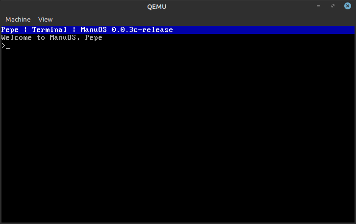

# ManuOS
ManuOS is a hobby os written in C and X86 assembly. Its main goal is to be simple and easy to use. It currently supports only X86 architecture. Arm support is planned in the future. 
## Features
- Two editions, C and asm
- Open source
- C edition is written in C and asm, full version, recommended
- Asm edition is written only in asm, minimal version
- Currently runs in real mode, planned to run in protected mode in the future
- OS uses kernel system calls to interact with the hardware
- Kernel can be customized for different architectures
- Sector Based File System(SBSF)
- Directories are only one character long
- Filenames are limited to 12 characters
## Programs
### C-edition, recommended
- Wuf++ interpreter
- Dices
- Calculator
- Bouncing ball
- Text editor
### Asm-edition
- Wuf++ interpreter
- Text editor

## Requirements
- Linux, if you use Windows you can use Cygwin or Linux Subsystem for Windows
- gcc
- NASM
- QEMU or other emulator

## How to build
1. Change directory to the edition you want to build, for example: ```cd ManuOS-C```
2. Build the edition: type ```make``` (in windows ```mingw32-make```)
3. Run the edition: type ```qemu-system-i386 -fda build/manuos.img``` 
3. In the OS terminal, type ```setup``` and follow the instructions, this needs to be done only once.

## Colors
- <span style="color:black">**Black**</span> - 0
- <span style="color:blue">**Blue**</span> - 1
- <span style="color:green">**Green**</span> - 2
- <span style="color:cyan">**Cyan**</span> - 3
- <span style="color:red">**Red**</span> - 4
- <span style="color:magenta">**Magenta**</span> - 5
- <span style="color:brown">**Brown**</span> - 6
- <span style="color:lightgray">**Light Gray**</span> - 7
- <span style="color:darkgray">**Dark Gray**</span> - 8
- <span style="color:lightblue">**Light Blue**</span> - 9
- <span style="color:lightgreen">**Light Green**</span> - 10
- <span style="color:lightcyan">**Light Cyan**</span> - 11
- <span style="color:orangered">**Light Red**</span> - 12
- <span style="color:pink">**Light Magenta**</span> - 13
- <span style="color:yellow">**Yellow**</span> - 14
- <span style="color:white">**White**</span> - 15

## Wuf++ language
ManuOS comes with a Wuf++ interpreter. See more on [here](https://github.com/Pepe-57/wpp). 
### Registers:
- **bx** - main register, bl mainly used
- **cx** - main pointer
- **sp** - stack pointer
- **dx** - temp register
- **pc** - program counter, instruction pointer
### Syntax:
- **+** - increment main register, *bx = bx + 1*
- **-** - decrement main register, *bx = bx - 1*
- **}** - push main register to stack, *[sp+2] = bx*
- **{** - pop main register from stack, *bx = [sp-2]*
- **.** - print main register as ascii character
- **,** - read ascii character to main register
- **&** - jump to location pointed by pointer, *pc = cx*
- **]** - jump to location pointed by instruction pointer + main pointer, *pc = pc + cx*
- **[** - jump to location pointed by instruction pointer - main pointer, *pc = pc - cx*
- **!** - invert main register, *bx = ~bx*
- **>** - increment pointer, *cx = cx + 1*
- **<** - decrement pointer, *cx = cx - 1*
- **$** - print pointer as ascii character
- **#[char]** - load char to main register
- **(** - loop start, loads dx with loop start address, *dx = pc*
- **)** - loop end, decrement pointer and loop until pointer = 0, *cx = cx - 1, if cx != 0 jump to dx*
- **"** - swap registers, *bx = dx, dx = bx*
- **%[char]** - compare main register with char, jump if equal to location pointed by pointer, *if bx == char jump to cx*
- **=** - halt program, *halt = 1*
- **/** - add main register and pointer, *bx = bx + cx*
- **\\** - sub main register and pointer, *bx = bx - cx*
- **@** - load zero to main register, *bx = 0*
- **^** - swap bl with bh, *bx = bh, bh = bl*

# Changelog
### ManuOS 0.0.2a release
- Stable release
- Small changes/bugfixes
### ManuOS 0.0.4c-pre release
- Major change: Added a simple file system
- Added more commands
- Small changes/bugfixes
### ManuOS 0.0.3c-release
- Stable release
- Small changes/bugfixes
### ManuOS 0.0.3c-dev preview 2
- Added disk management to the kernel
- General improvements
- Small changes/bugfixes
### ManuOS 0.0.3c-dev preview 1
- Added simple taskbar
- Added more kernel syscalls
- Small changes/bugfixes
- Added simple bouncing ball
### ManuOS 0.0.2c-alpha
- Kernel and OS now in different files
- Small changes/bugfixes
- Added simple calculator
### ManuOS 0.0.1c-alpha
- Initial release
- Kernel and OS in one file
### ManuOS 0.0.1a-alpha
- Initial release
- Kernel and OS in different files
# Versions
Legacy, alpha or dev versions are not maintained. 'c' stands for C edition and 'a' for asm edition
- v0.0.4c-pre-release (pre-release, latest)
- v0.0.3c-release
- v0.0.3c-dev preview 2
- v0.0.3c-dev preview 1
- v0.0.2a-release (latest, asm-edition)
- v0.0.2c-alpha
- v0.0.1c-alpha
- v0.0.1a-alpha
## Puppy Kernel
- v0.0.4c-pr (pre-release, latest)
- v0.0.3c-release
- v0.0.3c-dev2
- v0.0.3c-dev1
- v0.0.2a-release (latest, asm-edition)
- v0.0.2c
- v0.0.1c
- v0.0.1a 
